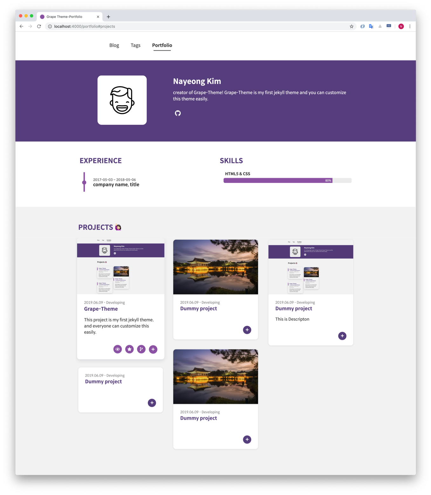
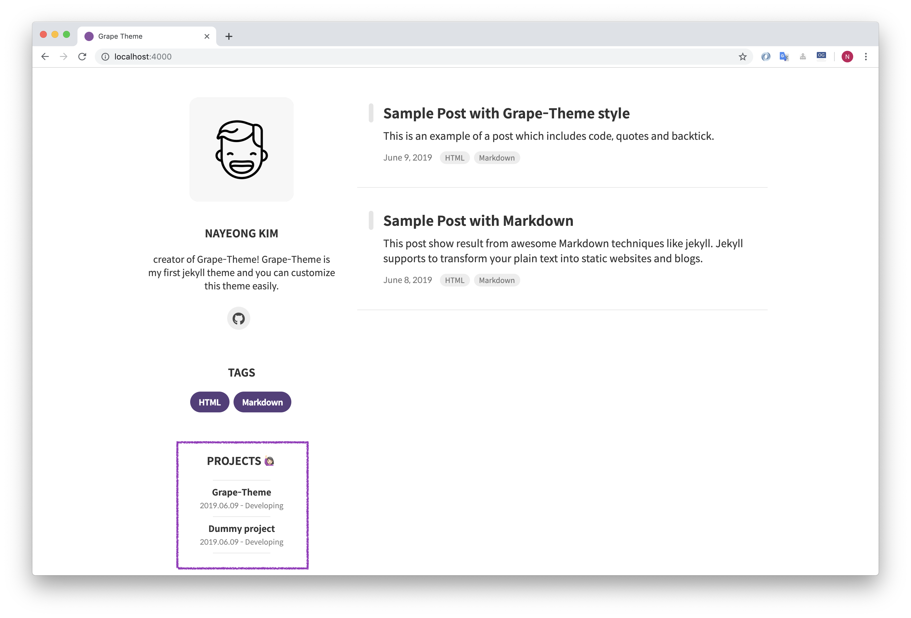
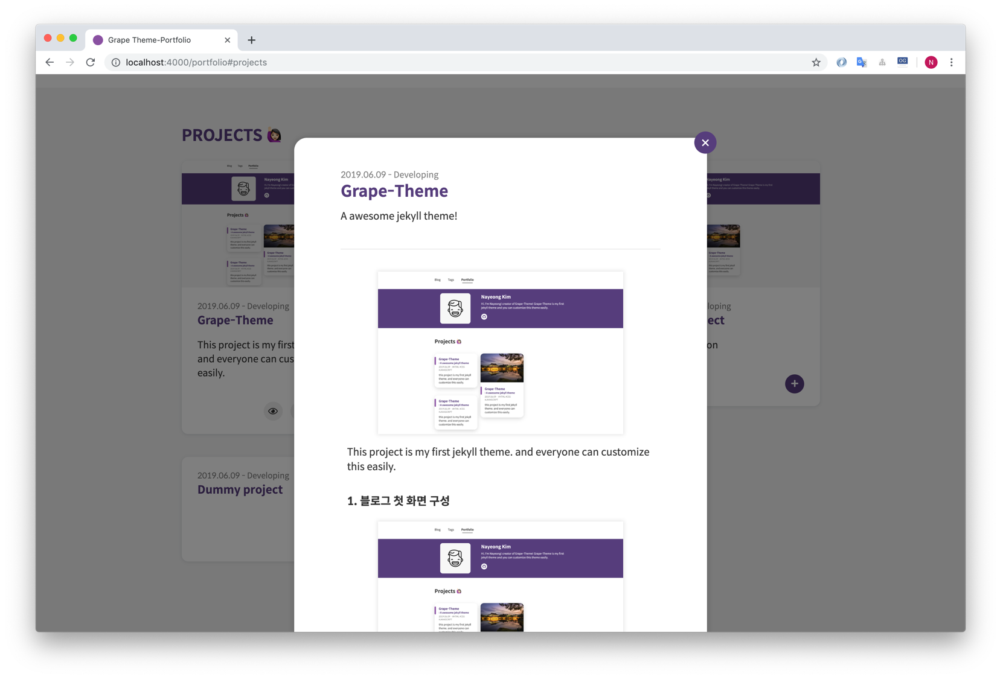

## Customizing

Grape-Theme에서는 자랑할 만한 두 가지 기능을 제공합니다. 홈 화면의 프로필 섹션과 포트폴리오 페이지의 프로젝트, 상세 프로필 기능이 그것 입니다. 이 모든 기능들은  `_config.yml` 와 `projects.yml` 파일을 수정하는 것만으로도 충분합니다.

### Blog Settings

기본적인 블로그 설정은 `config.yml` 에서 가능합니다.

#### Site configuration

```
baseurl: "{subpath}"
url : "https://{username}.github.io"

theme_settings :
  title : {blog title}
```


#### Profile Settings

간단한 프로필 정보는 홈 화면에서 출력되며, experience 및 skills 부분은 포트폴리오 페이지에서 함께 보여집니다.

```
profile :
  image : assets/img/{prorile image}
    username : {username}
    description : 
    experience :
      - start :
        end : 
        experience : {company name}, {title}
     skills : 
      - skill : 
        value : 85  # Percent value
```


#### Pagination

한 페이지에서 보여질 포스팅 개수를 정의합니다.

```
paginate: 5
```


#### Disqus

[Disqus shortname](https://help.disqus.com/en/articles/1717111-what-s-a-shortname)을 설정하고, 포스팅 속성에 `comments : True` 를 추가하면 블로그 글에서 댓글을 사용할 수 있습니다.

``` 
disqus_shortname :
```


### Portfolio Settings



프로젝트 세팅은 `_data/projects.yml`에서 가능합니다.

The Project configuration is available in `_data/projects.yml`.

포트폴리오 페이지에서는 프로젝트 목록과 상세보기를 모달로 지원합니다. 물론 상세보기는 선택적이며, 상세값이 `modal : False`인 경우 모달 버튼은 생성되지 않습니다.

- **print** : 
  
  -  `print : True` 를 선택한다면, 블로그의 홈 화면에서도 프로젝트의 정보가 출력됩니다.
  
   
  
- **modal** 
  - `modal : True` 를 선택한다면 모달 버튼이 활성화 됩니다.
  
    

```
print : True
modal : True  
```
당신의 프로젝트에 대한 링크와 상세 설명을 아래와 같이 추가하세요.

Add details(link, description) about your projects

```
url : https://github.com/naye0ng/Grape-Theme # Full URL
image : "portfolio.png" # path: assets/project/
date : 2019.06.09 - 2019.07.11
title : 
summary : 
description :  
# modal contents
contents :
  - title :
    image :      	    
    description : 
```


### Colors

블로그의 컬러들은 `_sass/base/_variable.scss` 에서 한번에 변경이 가능합니다.


## Posts in Grape theme

이 블로그의 모든 포스팅 스타일은  `_sass/base/_utility.scss` 에 정의되어 있으며 [Demo page](https://grape-theme.netlify.com/2019/06/08/markdown-and-html.html)와 [Demo page](https://grape-theme.netlify.com/2019/06/09/grape-theme-style.html)에서 여러 태그들의 출력을 확인할 수 있습니다.

### Create a new post

1. Create a `.md` inside `_posts` folder

   ```
   2019-07-11-grape-theme.md
   ```
   > 한글로 파일 이름을 만드는 경우, 구글 검색을 붙였을때 문제가 발생합니다. 되로록 영어를 사용해주세요:D
2. Write the [Front Matter](https://jekyllrb.com/docs/front-matter/) and content in the file.

   ```
   ---
   layout: post
   title: title
   subtitle : subtitle
   tags: [tag1, tag2]
   author: 
   comments : 
   ---
   ```


## License

The theme is available as open source under the terms of the [MIT License](https://opensource.org/licenses/MIT).


<br>

* * *

<br>

## 블로그 소스 관리
####  프로젝트 local 테스트
> `>`bundle install   
> `>`bundle exec jekyll serve   

####  파일 수정 후 커밋
> `>`git add .   
> `>`git commit -m “[커멘트입력]”   
> `>`git push   

<br>

## 마크다운문법(포스팅 작성시 참고)
#### 글자옵션
- __진하게__ or **진하게**
- _기울이기_ or *기울이기*
- ___진하게 기울이기___ or ***진하게 기울이기***
- ~~취소선~~
- <u>밑줄</u> (html문법 사용)

#### 코드 하이라이트

//test function
System.out.print("테 스 트");


#### 인용구
> 이렇게

#### backtit
` 여기 `

#### 수평선
* * *

#### 표
[표 generate 사이트](https://www.tablesgenerator.com/markdown_tables) 참고   

#### 이미지
   <br>

#### 연결링크
<https://repoleved33.github.io>                  <br>
[repoleved33 기술블로그](https://repoleved33.github.io)


